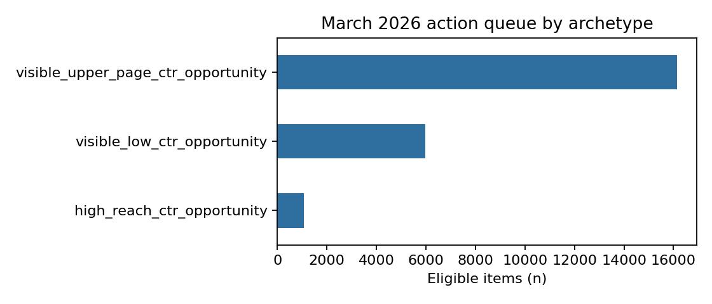

# Search visibility opportunities: an honest, human-reviewed ranking study

**Author:** Muhammad Hamza  
**Lane:** Search visibility / CTR opportunity  
**Date:** September 2026  
**Repository:** [Flyrank_ML_Internship_Hamza](https://github.com/hhammza/Flyrank_ML_Internship_Hamza)

## Abstract

This study asks whether decision-time search signals can help a content team rank pages for near-term review. I used the gated FlyRank warehouse's March 2026 daily performance partition, keeping client and content identifiers for grouping only and excluding future outcomes from the features. A Logistic Regression model used log impressions, log clicks, average position, and CTR, and was compared with the Week-4 transparent rule on the same client-held-out test rows. In the executed run, the model measured ROC-AUC 0.8458 and average precision 0.5224, while the rule's ROC-AUC was 0.5000 and average precision 0.1386; model precision@50 was 0.94. The output is decision support for human review, not proof that an edit causes more traffic or that a page definitely needs refreshing.

## 1. Introduction / problem statement

Content teams cannot review every page every day. The useful question is narrower: which pages look worth reviewing first because they have meaningful search visibility but unusually weak click-through?

The unit is a client-content item observed on a reporting date. The output is a ranked queue. A reviewer may inspect the title, snippet, search intent, brand context, and SERP features before choosing an action. A wrong call costs editorial time and may create an unnecessary change, so the queue is deliberately advisory.

## 2. Data

The analysis uses the FlyRank internship warehouse release, specifically `fact_content_daily_performance` for March 2026. The development frame contains 2,229,796 daily rows from 45 clients after the availability filter and next-day-label construction. The panel's broader documented grain is report date × client × content.

Features are measured on day *t*: GSC impressions, GSC clicks, GSC average position, and CTR. The proxy label is whether the same item receives at least one GSC click on the next observed day. Rows without usable GSC data are not treated as meaningful zero performance.

I excluded client/content hashes as model inputs, all next-day or future metrics, trend/label-derived fields, product flags, GA4 fields in this first model, and the June final-month sample. The June sample is a sealed outcome window under the project rules.

## 3. Methodology

### Baseline

The Week-4 rule flags a page when it has at least 500 impressions, average position 4–20, and CTR below 0.5%. Its score is a transparent combination of reach, position, and low CTR. The rule is a fair comparator because it is evaluated on exactly the same test rows and target as the model.

### Model and validation

The model is a standardized Logistic Regression with fixed seed `202609`. Its four inputs are `log_impressions`, `log_clicks`, `avg_position`, and `ctr`. The main split groups by client: no client appears in both train and test. This asks whether the ranking transfers to unseen clients rather than memorizing client-specific behavior.

The next-day proxy is imperfect and noisy. It describes observed search activity, not a ground-truth “needs refresh” decision. The W06 audit also compares an easier random-row split with the grouped design and documents why grouped validation is the more honest headline result.

### Leakage checks

The timeline is explicit: day-*t* features precede the day-*t+1* proxy. IDs are grouping keys only. A deliberate label-copy test reaches a perfect score, confirming that the harness detects leakage; that feature is never retained. The final feature list contains no target, future, trend, flag, or identifier field.

## 4. Results

| Method | ROC-AUC | Average precision | Precision@50 |
|---|---:|---:|---:|
| Week-4 rule | 0.5000 | 0.1386 | 0.08 |
| Logistic Regression | 0.8458 | 0.5224 | 0.94 |

The base rate in the model frame was 0.1192. The model therefore ranked the observed next-day click proxy much better than random ordering in this held-out client split. This is a measured comparison for this March slice, not a guarantee for another month.

The largest standardized coefficient was `log_impressions` (1.301), followed by `avg_position` (-0.630), `log_clicks` (0.401), and `ctr` (0.045). These directions are plausible: recent visibility and position contain information about near-term activity. Error inspection found 21,031 false positives and 39,534 false negatives under the top-decile review cut; sparse impressions and volatile next-day behavior are reasonable explanations to investigate, not causal conclusions.

*Figure 1. The W07 action queue grouped by readable review archetype. The chart describes queue composition, not expected causal lift.*

## 5. Limitations and honest framing

- The next-day click indicator is a proxy, not an editorial ground truth.
- This is observational warehouse data; it cannot establish that changing a title, snippet, or page causes more clicks.
- The March partition is one development period. Seasonal and client mix changes may alter performance.
- Grouped validation tests unseen clients, while a time-aware split would better mimic future deployment; both are useful and neither proves universal generalization.
- GSC availability and uneven panel history define the evaluated population.
- CTR is affected by brand intent, SERP features, seasonality, and measurement quality.

The safe claim is: **the model ranks items using decision-time signals associated with the observed next-day click proxy and can support human prioritization.**

## 6. Ranked recommendations

The W07 queue starts with visible, low-CTR pages. Each row has a score, `visible_low_ctr_position_opportunity` reason code, and `review_title_snippet_and_intent` action label.

1. Review high-reach eligible pages first because reviewer time is limited.
2. Check title and snippet alignment with the query intent.
3. Inspect brand/navigation context and SERP features before changing copy.
4. Record the reviewer decision and monitor the next period; do not claim lift from a single before/after comparison.

Never automate publishing, redirects, canonical changes, robots rules, deletion, or a claim that an edit caused growth. Those actions require qualified human review and, for causal conclusions, an experiment or stronger design.

## 7. Reproducibility

The executed notebooks are linked below:

- [W03 data contract](notebooks/w03_data_contract.ipynb)
- [W04 baseline](notebooks/w04_baseline_score.ipynb)
- [W05 model](notebooks/w05_model.ipynb)
- [W06 validation audit](notebooks/w06_validation_audit.ipynb)
- [W07 action playbook](notebooks/w07_action_playbook.ipynb)

Use Python 3.11 with DuckDB, pandas, scikit-learn, matplotlib, nbformat, and nbclient. In Colab, place the Hugging Face READ token in a secret named `HF_TOKEN`; never paste it into a cell. Run the notebooks from the repository root. The W07 notebook regenerates the queue at `work/outputs/baseline_action_playbook_queue.csv` and the reusable figure at `work/figures/w07_queue_archetypes.png`.

## 8. Acknowledgments & data credit

Built on the [FlyRank ML Internship dataset](https://flyrank.ai). Thanks to the FlyRank team for providing a realistic warehouse release for public-safe learning and evaluation.
